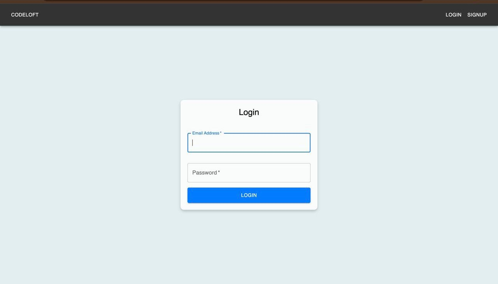
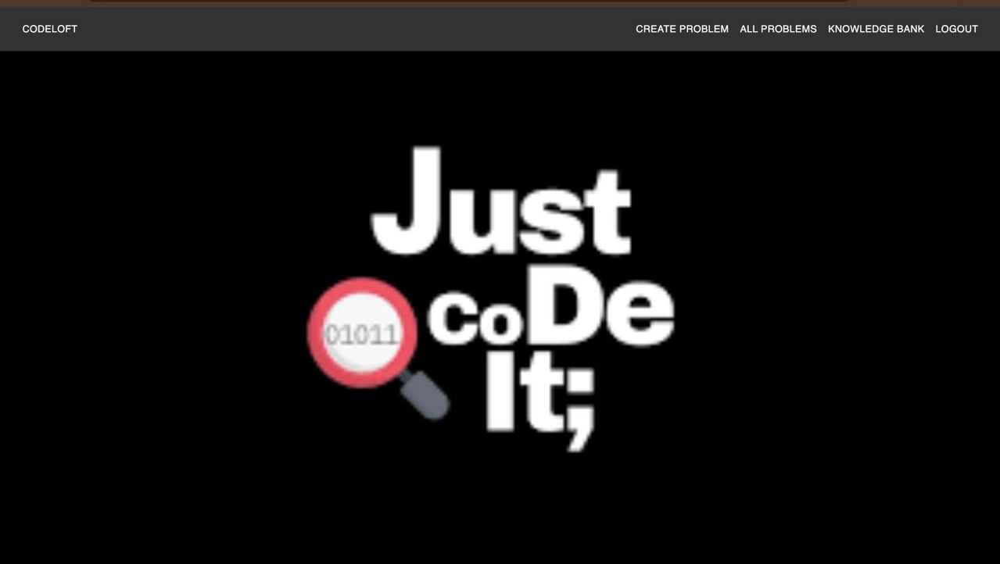
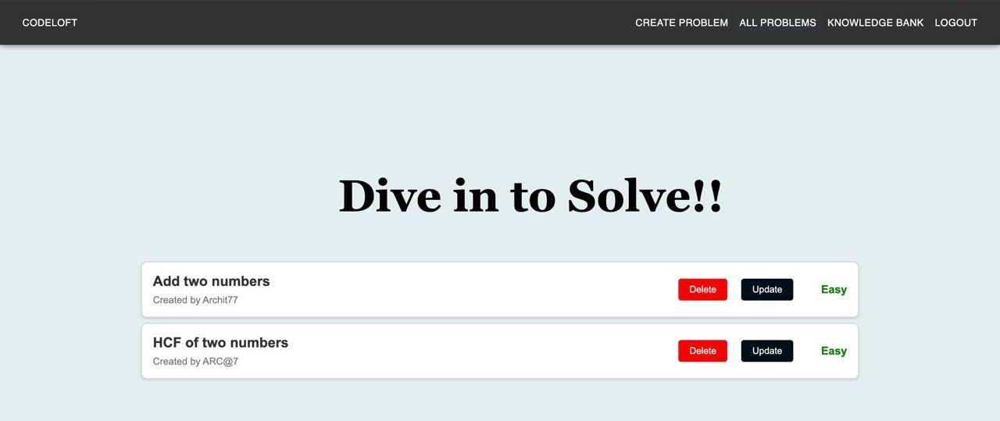
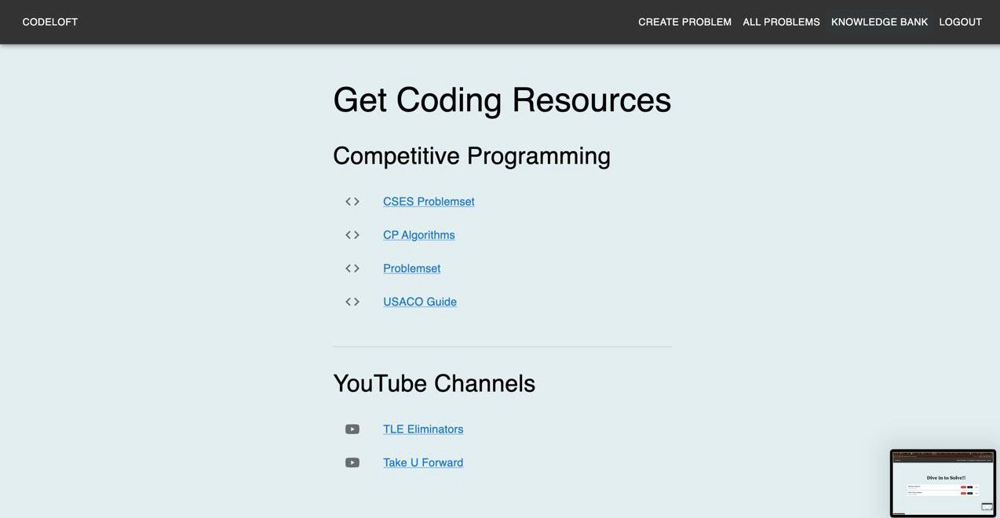
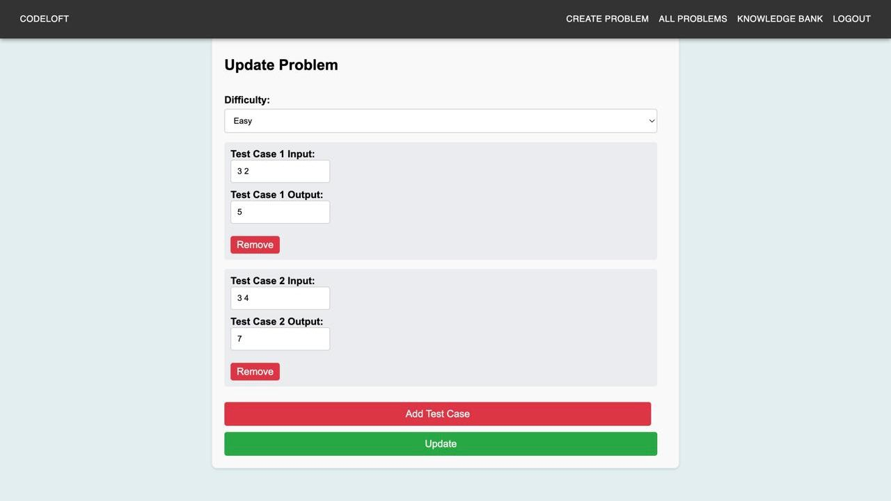
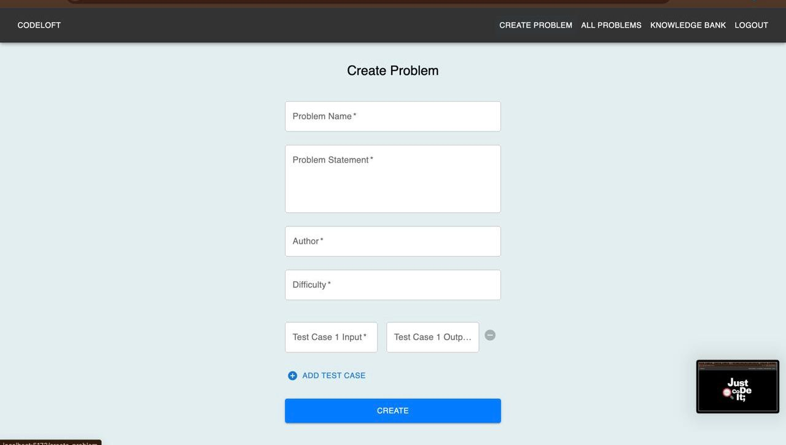
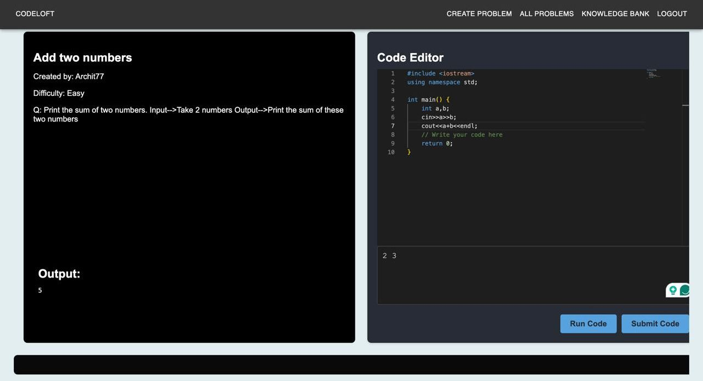
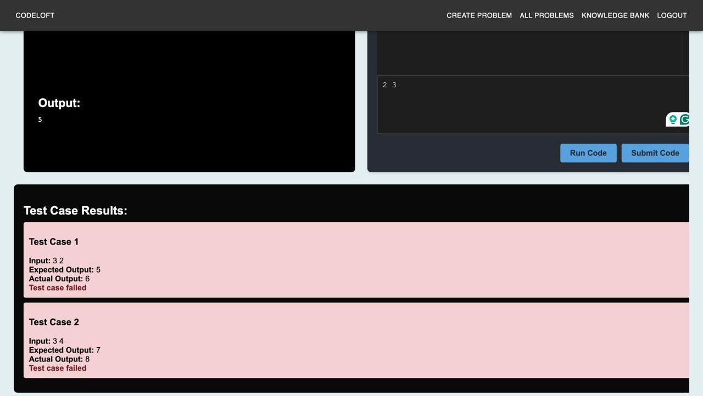

# CodeLoft

CodeLoft is an online judge platform that allows users to solve coding problems and get immediate verdict on their solutions. The platform authenticates and authorizes users using JSON Web Tokens (JWT) and differentiates between users and admins. Admins can create, update, and delete problems, while users can solve problems and receive verdicts based on predefined test cases.

## Features

- **Authentication and Authorization**: Secure login and registration using JWT.
- **Admin Capabilities**: Admin users can create, update, and delete coding problems.
- **Problem Solving**: Users can solve coding problems and submit solutions.
- **Immediate Feedback**: Upon submission, the platform provides a verdict indicating whether the solution passed all test cases.
- **CRUD Operations**: Supports CRUD operations for problems.
## Tech Stack
- **Frontend**: React
- **Backend**: Node.js, Express
- **Database**: MongoDB
- **Authentication**: JSON Web Tokens (JWT)
- **Compiler Frontend** : uses Monaco editor for compiler part
  
## Screenshots

    
    

  
  

